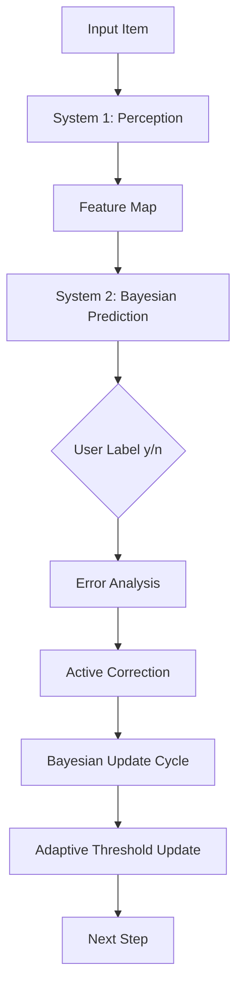

# Adaptive Neuro-Symbolic Concept Learning under Noisy Perception

A research-oriented interactive system that simulates **dual-process thinking**:

- **System 1 (Neural Perception):** extracts candidate features from natural language inputs.
- **System 2 (Bayesian Deliberation):** performs probabilistic program induction, forms explicit hypotheses, challenges weak assumptions, and updates beliefs from feedback.

This project is inspired by Josh Tenenbaum’s framing of human-like machine learning: move beyond static pattern matching toward **model building**, **compositional concepts**, and **Bayesian inference over structured hypotheses**.

Latest release: [v0.2.2](https://github.com/Ayushman125/Adaptive-Neuro-Symbolic-Concept-Learning-under-Noisy-Perception/releases/tag/v0.2.2)

Formal scientific documentation:

- `docs/THEORY.md` (equations and formal model)
- `docs/UPDATE_DYNAMICS.md` (state transitions and update order)
- `docs/ARCHITECTURE.md` (professional Mermaid diagrams)

---

## Quick Interactive Overview

Use this section as a clickable control panel while reading the project docs.

- Jump to: [Motivation](#1-research-motivation) · [Run](#6-run) · [Benchmarks](#9-debugging-and-validation) · [Research Framing](#11-research-framing-tenenbaum-alignment)
- Open full reports: [RESULTS.md](RESULTS.md) · [RESULTS_SUMMARY.md](RESULTS_SUMMARY.md)

### System Flow Diagram (Interactive)



### Mini Formulas

- Posterior-style hypothesis weighting: $P(h\mid D) \propto P(D\mid h)\,P(h)$
- Predictive uncertainty (entropy): $H_t=-\sum_i p_i\log p_i$
- Dynamic candidate budget: $B_t=\min\left(B_{max},\;12+4\log_2(1+|\mathcal{D}_t|)+|K_{obs,t}|\right)$
- Correction priority (hidden-important feature):
  $$
  \mathrm{priority}=\frac{\mathrm{appearance}}{\mathrm{importance}+0.01}\cdot(1-\mathrm{overlap})\cdot(0.5+\mathrm{recentPosRatio})
  $$

### Latest Results Snapshot

Current headline metrics (full model, latest published run):

| Benchmark | Accuracy | Brier | Convergence |
| --- | ---: | ---: | ---: |
| liquid | 0.90 | 0.4286 | 3.0 |
| scifi_movies | 0.85 | 0.3209 | 3.0 |
| devices | 0.90 | 0.4102 | 3.0 |
| noisy_food_adversarial | 0.75 | 0.2899 | 5.0 |
| marine_animals_adversarial | 0.90 | 0.3161 | 3.0 |

Primary plots:

- [Accuracy](evaluation/results/accuracy_by_benchmark.png)
- [Brier](evaluation/results/brier_by_benchmark.png)
- [Convergence](evaluation/results/convergence_by_benchmark.png)
- [Entropy Trend](evaluation/results/entropy_trend_by_benchmark.png)

#### How to Read the Plots (First-Time Guide)

- Start with **Accuracy**: higher is better; use it for overall task success.
- Check **Brier** next: lower is better; this tells you calibration quality (confidence vs correctness).
- Use **Convergence** to estimate learning speed: lower step count means faster stabilization.
- Inspect **Entropy Trend** for uncertainty behavior over time:
  - downward slope = the model is becoming more certain,
  - flat/positive slope = competing hypotheses remain unresolved.
- Practical rule of thumb: prefer runs with **high Accuracy + low Brier + low Convergence**; then verify entropy is not drifting upward.

---

## 1) Research Motivation

Core question:

> Can we build a system that behaves like an adaptive “thinking machine,” where perception is fast but noisy, and deliberation is explicit, corrigible, and self-improving?

The project targets exactly that:

- Learn concepts online from `y/n` feedback.
- Maintain explicit symbolic hypotheses (`atom`, `not`, `and`, `or`) with Bayesian weights.
- Use uncertainty and errors to actively ask better follow-up questions.
- Correct feature relevance dynamically (not frozen weights).
- Keep perception and reasoning separated so failures can be diagnosed and repaired.

---

## 2) What This System Is (and Is Not)

### It **is**

- A neuro-symbolic learner with transparent internal state.
- A Bayesian hypothesis search + update loop over symbolic programs.
- A feedback-driven system that adapts thresholds and feature importance online.

### It is **not**

- A static classifier trained once and deployed unchanged.
- Purely prompt-only reasoning.
- Domain-hardcoded concept logic.

System 1 may use an LLM backend for feature extraction, but concept induction and hypothesis selection happen in Python logic via Bayesian updates.

---

## 3) Current Architecture

### Entry point

- `Thinkingmachiene.py` (interactive loop)

### Main modules

- `Thinkingmachiene.py`
  - Orchestrates full System 1/System 2 cycle
  - Handles user interaction, active learning, concept reset, and reporting
- `belief_state.py`
  - Bayesian hypothesis generation/evaluation
  - Feature importance computation with recency blend + stale-feature demotion
- `adaptive_thresholds.py`
  - Learns threshold values via Bayesian-style updates from error signals
- `error_feedback_engine.py`
  - Processes prediction/correction errors and categorizes failure modes
- `feature_feedback_engine.py`
  - Triggers high-entropy feedback prompts and injects learned corrective features
- `tests/`
  - Unit tests for CLI helpers, reporting, experiments, and interactive edge cases

---

## 4) Key Learning Mechanisms

1. **Probabilistic Program Induction**
   - Candidate hypotheses are symbolic programs over extracted features.
   - Programs are scored by posterior-like weighting with complexity bias (Occam-style).

2. **Adaptive Feature Importance**
   - Importance is discriminative, class-contrastive, and penalizes universal/noisy features.
   - Recency-aware blending emphasizes recent evidence without discarding full history.
   - Stale positive features are demoted when they disappear from recent positives.

3. **Concept Anchors**
   - Anchor signals estimate which features define the concept.
   - Anchors blend historical and recent windows to reduce drift.

4. **Error-Driven Active Learning**
   - The system asks targeted yes/no feature questions under uncertainty.
   - Recent overlap/support gating favors cleaner discriminators.
   - Rejected features enter cooldown to avoid repetitive questioning loops.

5. **Human-in-the-Loop Correction**
   - User corrections adjust feature relevance and adaptive thresholds.
   - Confirmation memory preserves repeatedly validated features.

---

## 5) Installation

### Requirements

- Python 3.10+
- One perception backend key (recommended: Groq)
- Python packages: `requests`, `matplotlib` (for benchmark plots)

### Package install (pip)

```powershell
pip install adaptive-neuro-symbolic-concept-learning
```

Then run:

```powershell
thinkingmachine
```

### Setup (Windows PowerShell)

```powershell
cd C:\Users\HP\views
python -m venv venv
.\venv\Scripts\activate
pip install requests
pip install matplotlib
```

Optional (packaged install + test deps):

```powershell
pip install -e .[dev]
```

### Security note

- Never paste API keys into logs or console output.
- Use a `.env` file locally and keep it out of version control.
- See `.env.example` for the supported variables.

### Runtime observability

- Structured backend-call logs are enabled with `TM_STRUCTURED_LOGS=1`.
- Runtime metrics include success rate, p95 latency, and failure ratio.
- SLO and error-budget targets are defined in `SLO.md`.

---

## 6) Run

### Recommended backend: Groq

```powershell
$env:GROQ_API_KEY="<your_groq_api_key>"
$env:TM_PERCEPTION_BACKEND="groq"
python Thinkingmachiene.py
```

You should see:

- project banner
- System 1/2 role line
- interactive prompt: `[Input Item]:`

### Runtime commands

- `exit` → terminate session
- `/new` or `new concept` or `reset concept` → hard reset all learned concept state

### Quick Start (real console-style transcript)

```text
=== Adaptive Neuro-Symbolic Concept Learning under Noisy Perception ===
Role: System 1 (Neural Perception) + System 2 (Bayesian Logic)
Commands: type 'exit' to quit, or '/new' (or 'new concept') to hard reset learning.

[Input Item]: water, mercury
| SYSTEM 1 (Perception): Identified ['is_liquid', 'has_metal', 'can_freeze', 'is_toxic', 'can_boil']
| SYSTEM 2 (Monologue): 'Observing new data. No active theories yet.'
Is 'water, mercury' a match? (y/n): y
| SYSTEM 2: Updating theory weights based on evidence...

[Input Item]: iron
| SYSTEM 1 (Perception): Identified ['is_metallic', 'has_metal', 'can_melt', 'can_conduct']
| SYSTEM 2 (Monologue): 'My strongest theory is [lambda f: f.get('is_liquid', False)].
|                        I predict this is a NO-MATCH (...)'
Is 'iron' a match? (y/n): n
| SYSTEM 2: Updating theory weights based on evidence...

[Input Item]: melted butter, gasoline, milk
| SYSTEM 1 (Perception): Identified ['is_liquid', 'can_boil', 'can_melt', 'is_toxic']
| SYSTEM 2 (Monologue): 'My strongest theory is [lambda f: f.get('is_liquid', False)].
|                        I predict this is a MATCH (...)'
Is 'melted butter, gasoline, milk' a match? (y/n): y
| SYSTEM 2 (Active Learning): ...
|   ✓ Learned: boosted [...], reduced [...]
```

This is the expected interaction style: perception → inner monologue → user label → Bayesian update → occasional active-learning correction.

---

## 7) Interaction Protocol

Each cycle:

1. Enter an input item (or a comma-separated item group).
2. System 1 extracts features.
3. System 2 gives an inner-monologue prediction.
4. You label ground truth: `Is '<item>' a match? (y/n)`.
5. System updates hypotheses and may ask one active-learning question.

Tip: keep labels consistent per concept. Mixed/noisy labels are allowed but convergence will be slower.

---

## 8) Working Example Concepts

Below are practical concept scripts you can run manually.

## A) Concept: Sci-Fi Movies

### Goal
Learn the concept “is a sci-fi movie collection” and reject non-sci-fi and non-movies.

### Suggested sequence

**Positive (`y`)**
- `Dune, Blade Runner 2049, The Matrix, Interstellar`
- `Star Wars, Inception, Ex Machina`
- `Arrival, District 9, Alien`

**Negative (`n`)**
- `The Godfather, Titanic, Forrest Gump`
- `Braveheart, Gladiator, The Shawshank Redemption`
- `paper`
- `tree`
- `camera`
- `donkey`

### Expected behavior
- Top theories should gradually center around sci-fi-related discriminators.
- Non-movies should trend toward `NO-MATCH` after enough examples.

---

## B) Concept: Liquids

### Goal
Learn a broad “is liquid” concept despite noisy feature extraction.

### Suggested sequence

**Positive (`y`)**
- `water, mercury`
- `melted butter, gasoline, milk`
- `orange juice, maple syrup, tea, alcohol`
- `vinegar, vegetable oil, saliva, antifreeze, liquid glue`

**Negative (`n`)**
- `iron`
- `paper`
- `gun`
- `ice`

### Expected behavior
- `is_liquid` should gain anchor strength over time.
- Confounders (e.g., accidental `has_acid` spikes) should be reduced by correction + cooldown + recency logic.

---

## C) Concept: Electric Devices

### Goal
Learn a practical object concept distinct from generic household items.

### Suggested sequence

**Positive (`y`)**
- `laptop, smartphone, router`
- `camera, tablet, smart watch`
- `television, game console, projector`

**Negative (`n`)**
- `book, pen, notebook`
- `wooden chair, ceramic cup, paper`
- `apple, banana, orange`

### Expected behavior
- Theories should favor functionality and electronic-affordance features.
- Pure material-only signals should lose relevance unless discriminative.

---

## 9) Debugging and Validation

### Syntax check

```powershell
python -m py_compile Thinkingmachiene.py belief_state.py
```

### Automated test script

```powershell
python test_prediction.py
```

This script runs a sci-fi scenario and checks whether non-movie items are rejected.

### Reproducible benchmark harness (research mode)

Run fixed benchmarks (liquid, sci-fi, devices, noisy/adversarial) with multiple seeds:

```powershell
python evaluation\run_benchmarks.py --seeds 5
```

By default, this runs the **full model + ablation variants**:

- `ablate_recency_blend`
- `ablate_stale_feature_demotion`
- `ablate_active_learning_cooldown`
- `ablate_confirmation_memory_floor`
- `ablate_anchor_override`

Run full model only:

```powershell
python evaluation\run_benchmarks.py --seeds 5 --no-ablations
```

Run from experiment config (JSON):

```powershell
python evaluation\run_benchmarks.py --config evaluation\configs\default_with_ablations.json
python evaluation\run_benchmarks.py --config evaluation\configs\full_only_quick.json
```

Run with managed experiment tracking (timestamped folder + manifest):

```powershell
python evaluation\run_benchmarks.py --config evaluation\configs\full_only_quick.json --managed-run --run-name smoke_refactor
```

This creates:

- `evaluation/results*/<timestamp>_<run-name>/run_manifest.json`
- `evaluation/results*/latest_managed_run.json`

Config schema:

```json
{
  "benchmarks": "evaluation/benchmarks.json",
  "out": "evaluation/results",
  "seeds": 5,
  "run_ablations": true
}
```

Outputs are written to `evaluation/results/`:

- `per_step_metrics.csv`
- `per_run_metrics.csv`
- `summary_metrics.csv` (mean, std, and 95% CI across seeds)
- `ablation_deltas.csv` (delta vs full model per benchmark)
- `accuracy_by_benchmark.png`
- `brier_by_benchmark.png`
- `convergence_by_benchmark.png`
- `corrections_by_benchmark.png`
- `entropy_slope_by_benchmark.png`
- `entropy_trend_by_benchmark.png`

Custom benchmark file:

```powershell
python evaluation\run_benchmarks.py --benchmarks evaluation\benchmarks.json --out evaluation\results --seeds 3
```

Notes:

- Benchmark mode uses deterministic feature fixtures (`features` in JSON), bypassing external LLM variance for reproducibility.
- This evaluates the System 2 induction/adaptation stack under controlled noise and confounders.
- `ablation_deltas.csv` is generated only when ablations are enabled (default behavior; not generated with `--no-ablations`).
- Use `--managed-run` for publication/review workflows where run provenance must be preserved.

### Modular split starter (Upgrade #3)

Starter modules are now present for architecture migration:

- `perception/feature_processing.py`
- `perception/backend.py`
- `perception/config.py`
- `active_learning/corrections.py`
- `inference/update_cycle.py`
- `interaction/cli_helpers.py`

Current status:

- Interactive path remains fully functional in `Thinkingmachiene.py` and now routes correction + Bayesian update through modular wrappers.
- Benchmark/evaluation path uses the same modular update/correction modules for consistency.
- Perception backend routing and CLI helpers are modularized; remaining refactor scope is deeper perception pipeline decomposition.

---

## 10) Practical Tips for Better Convergence

- Start each concept with 2–3 clear positives and 2–3 clear negatives.
- Avoid ambiguous mixed batches early in learning.
- Answer active-learning prompts honestly (`y/n`) to shape feature relevance.
- Use `/new` before switching to a completely different concept domain.
- Prefer concrete item lists over abstract phrases.

---

## 11) Research Framing (Tenenbaum Alignment)

This implementation aligns with Tenenbaum-style principles by:

- representing hypotheses as explicit compositional programs,
- scoring/updating them probabilistically from evidence,
- separating noisy perception from symbolic inference,
- using active correction to improve structure rather than only fitting labels.

### How this project applies Tenenbaum’s approach in practice

1. **Probabilistic Program Induction (core mechanism)**
  - System 2 searches and updates symbolic programs (`atom`, `not`, `and`, `or`) as concept hypotheses.
  - Hypotheses are evaluated against observed history and weighted under uncertainty.

2. **Few-shot learning from sparse supervision**
  - The system is designed to begin with only a handful of `y/n` examples.
  - It bootstraps from small evidence, then refines using posterior updates, active correction, and adaptive thresholds.
  - This enables practical learning in low-data settings rather than requiring large offline training sets.

3. **Context awareness (history-sensitive inference)**
  - Current inference uses prior interaction context: recent labels, feature support, anchor history, and correction memory.
  - Recency-aware metrics and stale-feature demotion reduce drift from old/noisy signals.
  - Feature-feedback injection is context-gated (token overlap), so corrections transfer to related inputs instead of globally.

4. **Model building over pattern matching**
  - The model does not only memorize item-label pairs.
  - It forms reusable internal structure about *why* an item matches via explicit feature logic and uncertainty-driven question asking.

In short: this is a **model-building learner**, not only a pattern-matching predictor.

---

## 12) Current Limitations

- Perception quality still depends on backend feature extraction quality.
- Early bootstrap phase can be unstable with very small or inconsistent datasets.
- Some domains need more examples before symbolic hypotheses become sharp.

These are expected in online, human-in-the-loop concept induction systems and are active areas for refinement.

---

## 13) Project Status

This repository is an evolving research prototype focused on:

- interpretable concept learning,
- adaptive neuro-symbolic reasoning,
- and robust behavior under noisy perception.

Contributions and experiment reports are welcome.

---

## 14) License

This project is released under the **MIT License**.

See [LICENSE](LICENSE) for full text.
