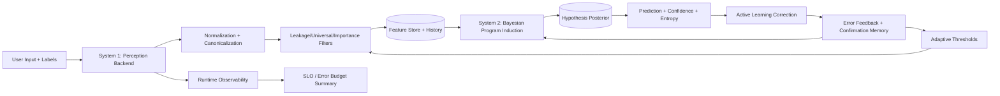
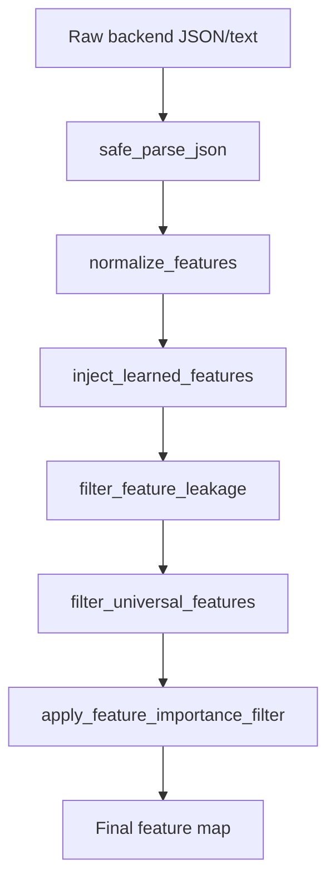
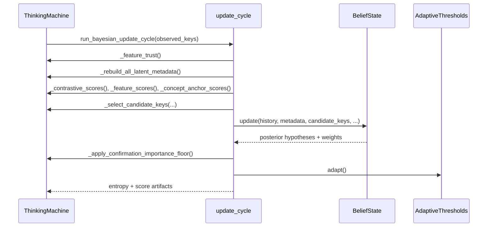
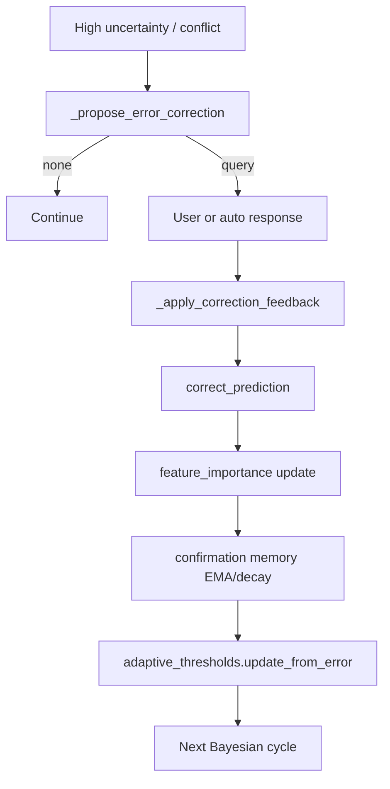
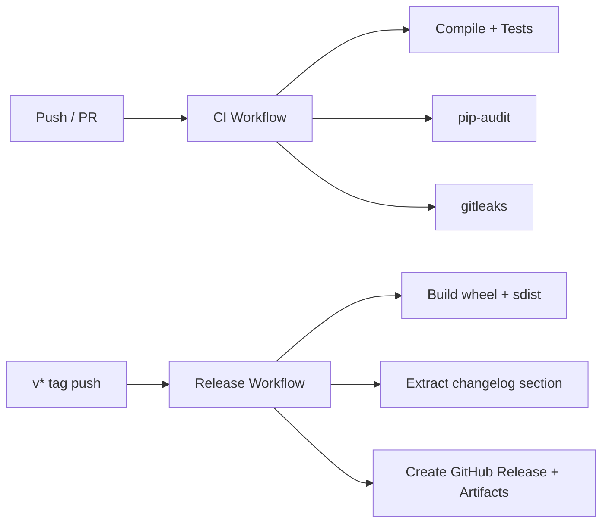

# Architecture and Working Diagrams

This document provides professional architecture views of the system.

## 1. High-level dual-process architecture

## 2. Perception pipeline (exact order)

## 3. Bayesian update sequence

## 4. Error-driven correction loop

## 5. CI/CD and release architecture

## 6. Scientific philosophy alignment

- **Model-based reasoning:** explicit symbolic hypotheses with Bayesian posterior updates.
- **Corrigibility:** user corrections directly alter feature importance and threshold trajectories.
- **Uncertainty-aware behavior:** entropy-driven active learning and conflict monitoring.
- **Measurement discipline:** runtime observability with explicit SLO/error-budget checks.

## 7. Reference map

- Theory equations: `docs/THEORY.md`
- State/update dynamics: `docs/UPDATE_DYNAMICS.md`
- Runtime SLO targets: `SLO.md`
