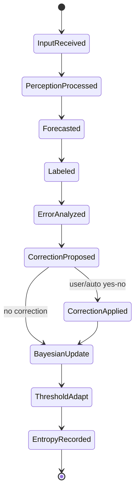

# Update Dynamics and State Transitions

This document describes the exact stepwise runtime update behavior.

## 1. End-to-end step transition

At step $t$ (non-interactive path `process_labeled_example`):

1. Input sanitization and sample id creation
2. Perception pipeline: `process_raw_features(machine, item, raw_features)`
3. Observation stats update (`feature_support`, observed/true/doc counts)
4. Fast S1 estimate (`_estimate_s1_judgment`)
5. S2 forecast from current posterior (`beliefs.predict`)
6. Append $(f_t, y_t)$ to history
7. Error feedback update on misprediction
8. Optional active correction proposal + application
9. Bayesian update cycle (`run_bayesian_update_cycle`)
10. Entropy recording and return metrics

## 2. Bayesian update cycle execution order

`inference/update_cycle.py` executes:

1. `feature_trust = _feature_trust()`
2. `_rebuild_all_latent_metadata(feature_trust)`
3. `contrastive_scores = _contrastive_scores()`
4. `key_scores = _feature_scores()`
5. `anchor_scores = _concept_anchor_scores()`
6. `candidate_keys = _select_candidate_keys(...)`
7. `beliefs.update(...)` (posterior recomputation)
8. `_apply_confirmation_importance_floor()`
9. `adaptive_thresholds.adapt()`
10. `entropy = beliefs.entropy()`

This order matters: thresholds adapt after posterior + correction effects are applied.

## 3. State update table

| State variable | Update rule | Trigger |
|---|---|---|
| `history` | append `(sample_id, truth)` | each labeled step |
| `metadata[sample_id]` | set to filtered feature map | each perception |
| `feature_support[k]` | `+= 1` if feature in item | each perception |
| `feature_observed_count[k]` | `+= 1` if observed in item | observation stats update |
| `feature_true_count[k]` | `+= 1` if observed and true | observation stats update |
| `feature_doc_count[k]` | doc-frequency-like increment | observation stats update |
| `beliefs.feature_importance[k]` | recomputed + correction updates + floor | Bayesian/correction cycle |
| `confirmation_memory[k]` | EMA or decay on correction | correction applied |
| `adaptive_thresholds.*` | Beta/gradient blend + decay | after each update cycle |
| `runtime_observability` counters | increment per backend call | inside `perceive()` |

## 4. Active-learning correction policy

Correction proposal is gated by:

- minimum history (`len(history) >= 2` for proposal, `>=3` for asking)
- uncertainty threshold: $U_t \ge 0.3$
- per-feature cooldown (`_is_feature_in_correction_cooldown`)

Priority ordering in `_propose_error_correction`:

1. discover hidden-important features
2. verify extraction consistency (posterior-prior gap)
3. boost low-importance but supported features
4. reduce over-emphasized features

### 4.1 Hidden-important criterion

A feature is considered hidden-important candidate if:

- appearance ratio in positives $>0.7$
- importance $<0.15$
- positive support $>1$
- recent positive support $\ge2$
- recent overlap $\le0.35$

Priority score:

$$
\text{priority} = \frac{\text{appearance}}{\text{importance}+0.01}
\cdot (1-\text{overlap})\cdot (0.5+\text{recentPosRatio})
$$

### 4.2 Extraction-consistency criterion

Uses gap:

$$
\text{gap}(k)=|s_{anchor}(k)| - I_k
$$

with conditions:

- gap $>0.3$
- extraction consistency $<0.7$
- anchor strength $>0.15$

## 5. Candidate-key selection dynamics

Selection in `_select_candidate_keys` combines:

- eligibility constraints (support/contrast/structural/observed)
- dynamic budget:

$$
B_t = \min\left(B_{max},\; 12 + 4\log_2(1+|\mathcal{D}_t|) + |K_{obs,t}|\right)
$$

- rank function (additive components):
  - key score
  - observed bonus `+2.0`
  - structural bonus `+0.7`
  - contrastive magnitude bonus
  - support bonus `min(1.2, 0.2 * support)`
  - concept boost `0.5 * |concept_score|`

- optional per-concept cap for diversity

## 6. Threshold adaptation dynamics

For each threshold family, `update_from_error` modifies Beta parameters and gradient direction.
Then `adapt()` applies:

1. gradient step
2. posterior-mean blend
3. confidence update
4. gradient decay

This yields a stable adaptive controller with memory and directionality.

## 7. Runtime observability evolution

For every backend call in `perceive()`:

- measure latency via `time.perf_counter()`
- record `(success/failure, status_code, error_type)`
- append latency sample
- emit structured JSON event if enabled

Summary metrics are computed on demand (`runtime_health_summary`).

## 8. Transition diagram

## 9. Determinism and reproducibility notes

- Benchmark mode can be deterministic via `features_override` and fixed seeds.
- Auto-correction policy is deterministic from class-conditional supports.
- Posterior update is deterministic given history and candidate set.
